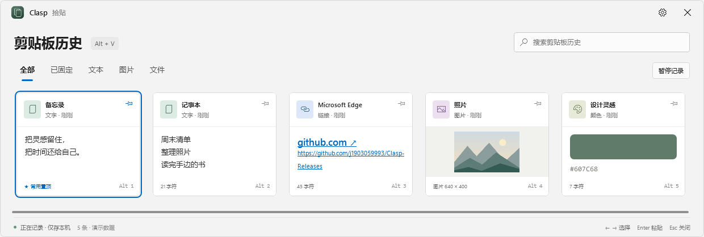

# Clasp 拾贴

轻量的 Windows 本地剪贴板管理器，让复制过的文字、链接、图片和文件随时可找、可用。

**[下载 Windows x64 便携版](https://github.com/j1903059993/Clasp-Releases/releases/download/v1.2.0-rc.4/Clasp-v1.2.0-rc.4-windows-x64.zip)** · **[所有版本](https://github.com/j1903059993/Clasp-Releases/releases)** · **[使用说明](docs/USAGE.md)** · **[反馈问题](https://github.com/j1903059993/Clasp-Releases/issues)**

## 下载与运行

1. 打开 **[Releases](https://github.com/j1903059993/Clasp-Releases/releases)**，选择需要的版本。
2. 在 **Assets** 中下载 `Clasp-v版本-windows-x64.zip`。
3. 解压到可写入的文件夹，双击 `Clasp.exe`。

当前为免安装便携预览版，支持 **Windows 10/11 x64**，需要 **.NET Framework 4.8**。程序暂未进行代码签名。请下载应用附件；`Source code (zip)` 仅包含下载仓库的说明文件，不是应用。

**当前版本：1.2.0-rc.4**，面板贴在屏幕最底部并占满整宽，顶部圆角镂空，使用毛玻璃与可调透明度，历史只横向滚动，图片按完整容貌显示。[查看更新日志](CHANGELOG.md)。

## 可以做什么

- 记录文字、网页链接、图片和文件，按内容、来源或文件名搜索。
- 固定常用内容，使用快捷键快速粘贴。
- 预览图片，支持缩放、拖动和最大化。
- 保存文件副本，原文件移动后仍可使用已备份的内容。
- 自定义唤醒快捷键、面板透明度、数据目录、动画和开机自启。

默认按 **Alt + V** 打开面板，按 **Enter** 粘贴选中项，按 **Esc** 收起。快捷键冲突时可在设置中修改。

## 数据与升级

无需账号，剪贴板记录保存在本机，无上传、无遥测。数据目前未加密，处理敏感内容时可暂停记录。

默认数据位于程序旁的 `Data` 文件夹，也可在设置中迁移。升级前退出程序，保留 `Data` 与 `settings.json`，再替换应用文件。详细操作见[使用说明](docs/USAGE.md)。

## 问题反馈

遇到问题，请在 [Issues](https://github.com/j1903059993/Clasp-Releases/issues) 提供应用版本、Windows 版本与复现步骤；截图请遮去私人信息。

此仓库仅提供官方应用下载和使用说明，不包含应用源代码。

## 许可证

本项目不开源。允许下载官方发布的应用用于非商业用途，不允许修改或商用。详见[应用使用许可](LICENSE.txt)。
